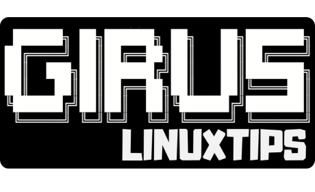

# Resolução do Desafio PICK: Criação de Imagens para GIRUS

## Objetivos do Desafio

Durante os próximos 30 dias, os estudantes deverão:

1. **Criar imagens Docker para:**
   - Backend (Go): Uma imagem otimizada para executar a API do GIRUS
   - Frontend (React): Uma imagem para a interface web do GIRUS
   - Kubernetes com Istio: Uma imagem baseada no container-images/girus-k8s, mas com Istio integrado

2. **Requisitos técnicos:**
   - [√] As imagens devem ter o menor número possível de vulnerabilidades críticas
   - [√] Utilizar repositório privado para armazenar as imagens
   - [√] Seguir boas práticas de construção de imagens Docker
   - [x] Implementar um deployment usando Helm

## Estrutura do Projeto

O projeto GIRUS possui a seguinte estrutura:

1. **Backend (Go)**: API para orquestrar laboratórios via Kubernetes
2. **Frontend (React)**: Interface web com terminal interativo
3. **Container Images**:
   - `girus-k8s`: Imagem com Kind e Kubernetes para laboratórios de K8s
   - `girus-devops`: Imagem com ferramentas de DevOps para laboratórios práticos
   - `girus-localstack`: Imagem com LocalStack para simular serviços AWS

Você deve se basear nos Dockerfiles existentes em `container-images/` para criar suas próprias versões otimizadas.

## Testes da Aplicação

### Testando o Backend

1. **Build e execução local do backend**:
   ```bash
   # Entre no diretório backend
   cd backend
   # No diretório backend execute
   go run main.go
   ```

2. **Executando sua imagem Docker do backend**:
   ```bash
   # Construa sua imagem no diretório /backend
   docker build -t yllebs/girus-backend:latest -f Dockerfile .
   
   # Execute localmente
   docker run -p 8080:8080 -v ~/.kube/config:/root/.kube/config yllebs/girus-backend:latest

   # Run with the env var set
   docker run -p 8080:8080 \
   -v ~/.kube/config:/root/.kube/config \
   -e KUBECONFIG=/root/.kube/config \
   girus-backend

   # Verifique se a API está respondendo
   curl http://localhost:8080/api/v1/health
   ```

### Testando o Frontend

1. **Desenvolvimento local do frontend**:
   ```bash
   # Entre no diretório frontend/web
   cd frontend/web
   
   # Instale dependências
   npm install
   
   # Execute em modo de desenvolvimento
   npm start
   ```

2. **Testando sua imagem Docker do frontend**:
   ```bash
   # Construa sua imagem
   docker build -t yllebs/girus-frontend:latest -f Dockerfile .
   
   # Execute localmente (apontando para o backend)
   docker run -p 3000:80 -e BACKEND_URL=http://localhost:8080 yllebs/giru-frontend:latest
   ```

### Relatório Trivy
[Relatório de vulnerabilidades das imagens](/trivy-reports.md)

### Integrando com o Cluster GIRUS

1. **Substituindo as imagens no cluster existente**:
   ```bash
   # Encontre os deployments existentes
   kubectl get deployments -n girus
   
   # Atualize a imagem do backend
   kubectl set image deployment/girus-backend backend=seu-repo/strigus-backend:versao -n girus
   
   # Atualize a imagem do frontend
   kubectl set image deployment/girus-frontend frontend=seu-repo/strigus-frontend:versao -n girus
   ```

2. **Verificação dos logs para debug**:
   ```bash
   # Verifique logs do backend
   kubectl logs -f deployment/girus-backend -n girus
   
   # Verifique logs do frontend
   kubectl logs -f deployment/girus-frontend -n girus
   ```

Para testar corretamente suas imagens, certifique-se de que todas as variáveis de ambiente necessárias estejam configuradas e os volumes adequados estejam montados para acesso ao Kubernetes.

## Fluxo de Trabalho para Teste

Para testar suas imagens, siga estas etapas:

1. **Instale o GIRUS CLI**:
   ```bash
   curl -fsSL https://girus.linuxtips.io | bash
   ```

2. **Crie um cluster de teste**:
   ```bash
   girus create cluster
   ```

3. **Carregue suas imagens customizadas no cluster**:
   ```bash
   # Substitua [seu-repositorio], [sua-imagem] e [versao] pelos valores corretos
   kind load docker-image [seu-repositorio]/girus-frontend:[versao] --name girus
   kind load docker-image [seu-repositorio]/girus-backend:[versao] --name girus
   kind load docker-image [seu-repositorio]/girus-k8s-istio:[versao] --name girus
   ```

4. **Substitua as imagens originais pelas suas**:
   - Edite os manifestos do Kubernetes ou valores do Helm para apontar para suas imagens
   - Reimplante os componentes do GIRUS com suas imagens personalizadas

## Entregáveis

1. **Dockerfiles otimizados** para:
   - Backend
   - Frontend
   - Kubernetes com Istio

2. **Relatório de vulnerabilidades** das imagens

3. **Repositório privado** com as imagens

4. **Charts Helm** para deployment da aplicação

5. **README detalhado** com explicações sobre:
   - Escolhas de otimização
   - Como utilizar as imagens
   - Processo de deployment
   - Lições aprendidas

## Critérios de Avaliação

Os projetos serão avaliados com base em:

1. **Segurança**: Redução de vulnerabilidades nas imagens
2. **Otimização**: Tamanho e camadas das imagens
3. **Funcionalidade**: Correto funcionamento da aplicação
4. **Documentação**: Clareza e completude do README
5. **Automação**: Implementação de CI/CD e Helm charts

## Recursos Adicionais

- **Container Images**: Explore os Dockerfiles existentes em `container-images/`
- **Código Fonte**: Analise `web/` (frontend) e `internal/` (backend) para entender os requisitos
- **Documentação**: Leia o README.md original do GIRUS para compreender a plataforma

## Dicas para o Desafio

1. **Analise as dependências** antes de criar os Dockerfiles
2. **Utilize imagens base leves** como alpine ou distroless quando possível
3. **Implemente multi-stage builds** para reduzir o tamanho final
4. **Escaneie suas imagens** com ferramentas como Trivy ou Clair
5. **Teste exaustivamente** antes da entrega final
